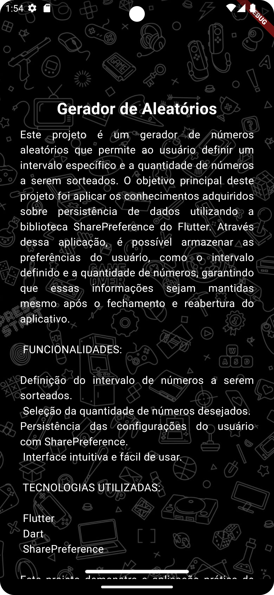
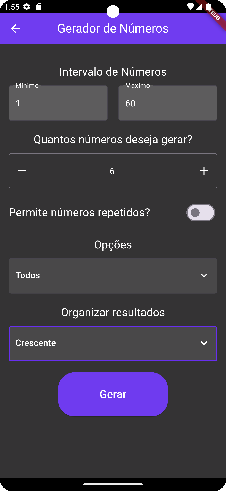
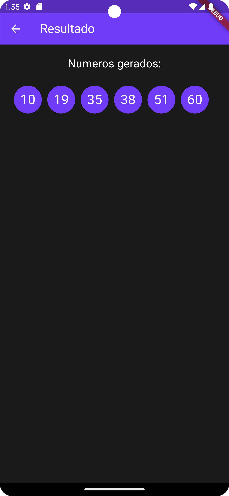
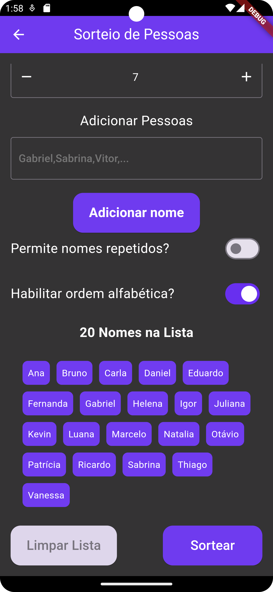
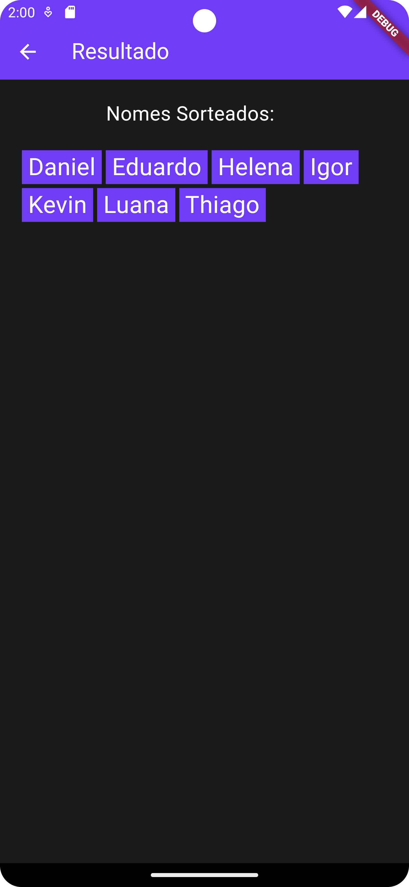

# Gerador de Aleatórios 🎲

Bem-vindo ao Gerador de Aleatórios! Este é um projeto divertido desenvolvido em Flutter para te ajudar a gerar números aleatórios ou realizar sorteios de nomes de forma rápida e fácil. 🚀

## Funcionalidades

- **Gerador de Números Aleatórios:** Gere números aleatórios com um toque de um botão!
- **Sorteio de Nomes:** Precisa sortear quem vai fazer o café? Não se preocupe, o Gerador de Aleatórios está aqui para te ajudar!

## Motivação

Este projeto foi desenvolvido com o intuito de explorar e aprender mais sobre o uso de Shared Preferences em Flutter. Além disso, também queríamos criar uma ferramenta divertida e útil para quem precisa de uma ajudinha extra em sorteios ou decisões aleatórias do dia a dia.

## Capturas de Tela

## Como Usar

1. Clone o repositório em sua máquina local.
2. Abra o projeto no seu editor de código favorito.
3. Certifique-se de ter o Flutter instalado em sua máquina.
4. Execute o projeto com `flutter run`.

## Contribuição

Contribuições são sempre bem-vindas! Se você encontrou algum bug ou tem alguma ideia para melhorar o Gerador de Aleatórios, sinta-se à vontade para abrir uma issue ou enviar um pull request.

## Licença

Este projeto está licenciado sob a Licença MIT - veja o arquivo [LICENSE](LICENSE) para mais detalhes.
